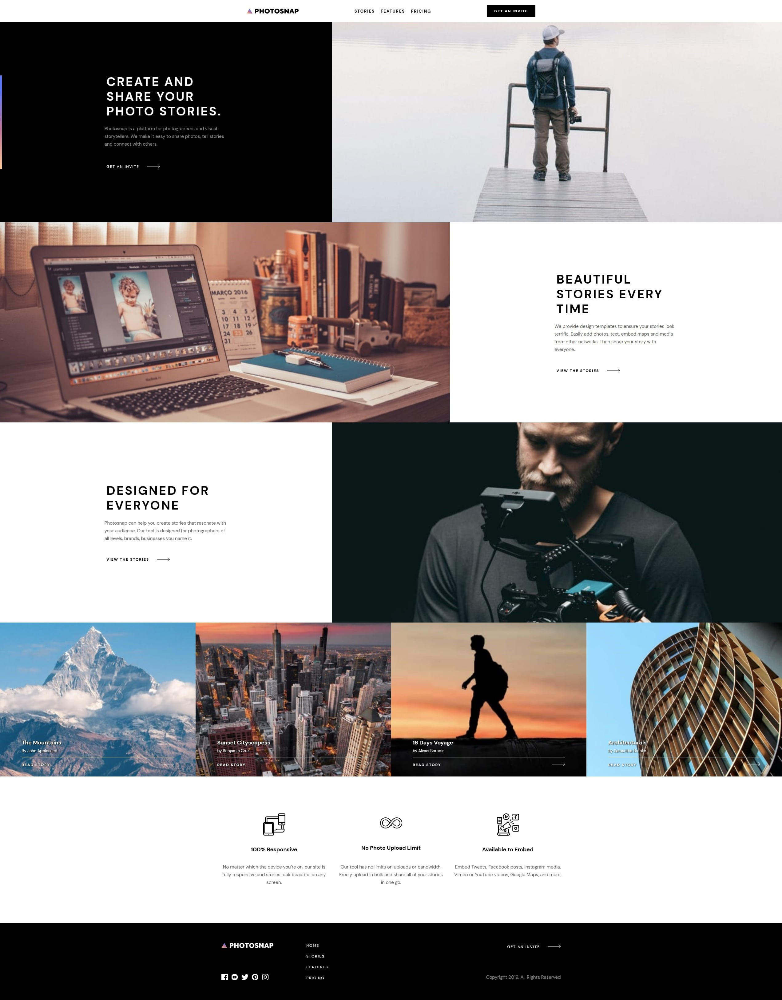

# Frontend Mentor - Photosnap Website solution

This is a solution to the [Photosnap Website challenge on Frontend Mentor](https://www.frontendmentor.io/challenges/photosnap-multipage-website-nMDSrNmNW). Frontend Mentor challenges help you improve your coding skills by building realistic projects.

My solution is identical compare to the intitial design ✔

## Table of contents

- [Overview](#overview)
  - [The challenge](#the-challenge)
  - [Screenshot](#screenshot)
  - [Links](#links)
- [My process](#my-process)
  - [Built with](#built-with)
  - [What I learned](#what-i-learned)
- [Author](#author)

## Overview

### The challenge

Users should be able to:

- View the optimal layout for each page depending on their device's screen size
- See hover states for all interactive elements throughout the site

### Screenshot

### Links

- Solution URL: [https://www.frontendmentor.io/solutions/photosnap-html-css-js-J5QcWmi2r](https://www.frontendmentor.io/solutions/photosnap-html-css-js-J5QcWmi2r)
- Live Site URL: [https://clement-baradel-photosnap.vercel.app](https://clement-baradel-photosnap.vercel.app/)

## My process

### Built with

- Semantic HTML5 markup
- CSS custom properties
- Flexbox
- Mobile-first workflow
- Javascript ES6

### What I learned

As my first projects using HTML & CSS i learned a lot with flexbox, and positioning cards.

* CSS Basics
* Flexbox
* Button with JS to switch price (per month / per year)

## Author

- Website - SOON
- Frontend Mentor - [@Koyazh](https://www.frontendmentor.io/profile/Koyazh)
- Linkedin - [BaradelClément](https://www.linkedin.com/in/cl%C3%A9ment-baradel-330460209)
